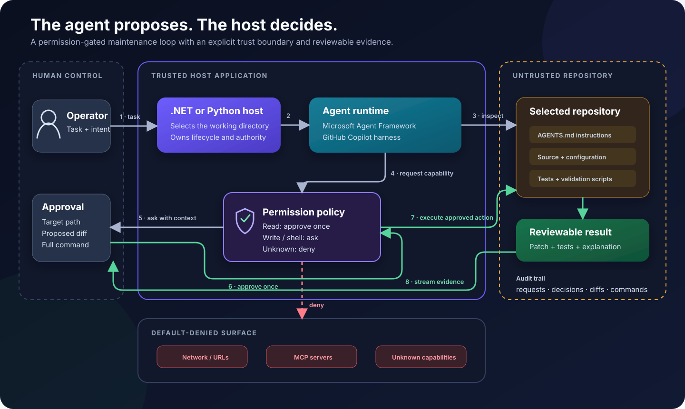

<div align="center">

# 🛠️ Safe Repository Maintenance Agent

**Give an AI agent a repository, not the keys to the kingdom.**

The same permission-gated coding agent, implemented in **.NET** and **Python** with the GitHub Copilot harness and Microsoft Agent Framework.

[](https://github.com/sahansera/safe-repository-maintenance-agent/actions/workflows/ci.yml) [](dotnet/) [](python/) [](LICENSE)

[Try the demo](#-try-the-demo) · [How it works](#-how-it-works) · [Safety model](#-safety-model) · [Tutorials](#-tutorials)

</div>

---

Most agent demos celebrate the moment a model edits a file. This project starts with the next
question:

> Who decides whether that edit, command, or network request is actually allowed?

This repository contains two equivalent command-line agents. Both can inspect a local repository,
propose a repair, run focused validation, and explain the result. Both route side effects through a
small policy owned by the host application.

```text
Agent: I can fix the failing test by adding .trim().

[permission: write]
File: fixture/src/normalize-title.js

-  return value.toLowerCase().replace(/\s+/g, "-");
+  return value.trim().toLowerCase().replace(/\s+/g, "-");

Approve once? [y/N]
```

No invisible `--yolo`. No permission-by-prompt. No surprise pull request at 2 a.m.

## ✨ What is inside?

- **Two real implementations** - .NET 10 and Python 3.11+
- **One shared contract** - same task, fixture, permissions, and expected result
- **A deliberately broken fixture** - small enough to understand at a glance
- **Human approval** - required for file writes and shell commands
- **Fail-closed defaults** - URL, MCP, and unknown capabilities are denied
- **Streaming output** - watch the agent work and see every permission boundary
- **Deterministic policy tests** - no model request or subscription required
- **CI for both languages** - because “the agent said it passed” is not test evidence

## 🚀 Try the demo

The fixture has one failing regression test. The agent must read its instructions, find the bug, ask
before editing, ask again before running `npm test`, and finish with a report.

### .NET

Requires [.NET 10](https://dotnet.microsoft.com/download/dotnet/10.0) and an active GitHub Copilot
subscription.

```bash
git clone https://github.com/sahansera/safe-repository-maintenance-agent.git
cd safe-repository-maintenance-agent/dotnet
dotnet run -- ../fixture
```

Run the policy tests:

```bash
dotnet test
```

### Python

Requires Python 3.11 or later and an active GitHub Copilot subscription.

```bash
git clone https://github.com/sahansera/safe-repository-maintenance-agent.git
cd safe-repository-maintenance-agent/python
python -m venv .venv
source .venv/bin/activate
pip install -e '.[dev]'
safe-repo-agent ../fixture
```

Run the policy tests:

```bash
pytest
```

The .NET and Python packages bundle the compatible Copilot runtime. Authentication still requires an
active GitHub Copilot subscription and may prompt you to sign in on the first end-to-end run.

After the agent repairs the fixture, reset the tiny crime scene:

```bash
git restore fixture/src/normalize-title.js fixture/test/normalize-title.test.js
```

## 🧠 How it works



The maintenance loop is intentionally asymmetric: the agent can inspect and propose, but only the
host can grant authority. Writes and shell commands return to the operator with concrete context;
network, MCP, and unknown capabilities stop at the policy boundary.

The responsibilities are deliberately separate:

| Layer | Responsibility |
| --- | --- |
| GitHub Copilot harness | Planning, model calls, repository tools, and tool execution |
| Microsoft Agent Framework | Agent abstraction, lifecycle, streaming, sessions, and telemetry |
| .NET or Python host | Working directory, instructions, authorization, and operator interaction |
| Repository | Source, tests, project guidance, and validation commands |

The host application owns authority. Repository instructions can guide the agent, but they cannot
expand the permissions granted by host code.

Dive deeper into the [architecture](docs/architecture.md) and
[permission model](docs/permission-model.md).

## 🔐 Safety model

The policy is intentionally boring. Boring authorization code is a feature.

| Capability | Default decision | Why |
| --- | --- | --- |
| Read inside the working directory | Approve once | The agent needs repository context |
| Write a file | Ask the operator | Show the target path and proposed diff |
| Run a shell command | Ask the operator | Show the complete command |
| Fetch a URL | Deny | The demo does not need network access |
| Call an MCP server | Deny | External tools are outside the demo boundary |
| Unknown capability | Deny | New authority must be granted deliberately |

The sample also disables ambient Copilot configuration discovery. The agent must read `AGENTS.md`
from the selected working directory explicitly, so a nested checkout does not silently inherit
instructions from a parent repository.

### What the agent cannot do

By default, it cannot:

- Access the network or call MCP servers
- Install packages
- Commit or push changes
- Create or merge pull requests
- Change files outside the selected working directory

> [!WARNING]
> A working directory is scope, not a sandbox. Run untrusted repositories in a disposable container
> or microVM with bounded resources, no ambient credentials, and network access denied by default.

## 🗂️ Project map

```text
.
├── dotnet/                  # .NET 10 host and xUnit policy tests
├── python/                  # Async Python host and pytest policy tests
├── fixture/                 # Deliberately failing, language-neutral target repo
├── docs/
│   ├── architecture.md      # Runtime responsibilities and trust boundaries
│   └── permission-model.md  # Decisions, rationale, and production evolution
└── .github/workflows/ci.yml # Tests both hosts
```

## 📚 Tutorials

Want the implementation explained one decision at a time?

- [Build a Safe Repository Maintenance Agent in .NET](https://sahansera.dev/safe-repository-maintenance-agent-dotnet/)
- [Build a Safe Repository Maintenance Agent in Python](https://sahansera.dev/safe-repository-maintenance-agent-python/)

Both tutorials build the same agent against the same fixture. That makes the language differences
easy to see without changing the problem halfway through.

## 🧪 Testing philosophy

There are two different things to test:

1. **Authority is deterministic.** Each language tests every policy branch without starting Copilot.
2. **Agent behavior is evidence-based.** End-to-end runs must produce a visible diff and passing
   fixture tests.

The fixture starts broken on purpose. A failing `npm test` before the agent runs is the setup, not a
CI strategy. CI runs the .NET and Python policy suites instead.

## 🗺️ Roadmap

- [x] Equivalent .NET and Python hosts
- [x] Permission-gated writes and shell commands
- [x] Fail-closed URL and MCP policy
- [x] Shared repair fixture
- [x] Two-language CI
- [ ] Containerized runner for untrusted repositories
- [ ] OTLP example with redacted agent telemetry
- [ ] Durable approval adapter for service workloads
- [ ] Additional fixtures for dependency and documentation maintenance

Have an idea that preserves the safety boundary? Open an issue and describe the task, authority it
needs, and how success can be verified.

## 🤝 Contributing

Contributions are welcome, especially when they improve the comparison between the two hosts.

Before opening a pull request:

1. Keep .NET and Python behavior aligned when changing shared policy.
2. Run `dotnet test` and `pytest`.
3. Keep the fixture deliberately failing before an agent repairs it.
4. Do not add credentials, recorded authentication state, or generated Copilot session data.
5. Explain any new permission and why the agent genuinely needs it.

For substantial changes, start with an issue so the authority boundary is clear before implementation.

## 📦 Package status

The project pins versions that were verified together. Microsoft Agent Framework's GitHub Copilot
integration is stable, while the underlying GitHub Copilot SDK is currently public preview. Review
release notes and rerun policy and end-to-end tests before upgrading.

## 📄 License

Licensed under the [MIT License](LICENSE). Build something useful, keep the safety rails on.
