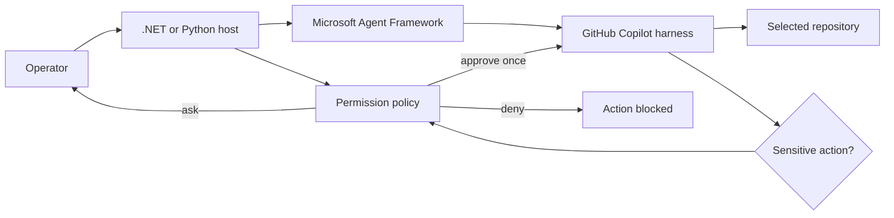

# Safe Repository Maintenance Agent

This repository implements the same GitHub Copilot-backed repository maintenance agent in .NET and
Python. Both versions use Microsoft Agent Framework, stream their responses, and route filesystem and
shell operations through the same permission policy.

The agent can work against any local repository. The included fixture is deliberately small and has
one failing test, so it is safe to use when trying write and shell permissions for the first time.

The companion tutorials explain each implementation:

- [Build a Safe Repository Maintenance Agent in .NET](https://sahansera.dev/safe-repository-maintenance-agent-dotnet/)
- [Build a Safe Repository Maintenance Agent in Python](https://sahansera.dev/safe-repository-maintenance-agent-python/)

## Architecture



The host application owns authority. Repository instructions can guide the agent, but they cannot
expand the permissions granted by the host policy. See [the architecture](docs/architecture.md) and
[permission model](docs/permission-model.md) for the full boundary.

## Permission policy

| Capability | Default decision |
| --- | --- |
| Read files inside the working directory | Approve once |
| Write files | Ask the operator |
| Run shell commands | Ask the operator |
| Fetch URLs or call MCP servers | Deny |
| Unknown capabilities | Deny |

The policy is intentionally conservative. The Copilot runtime is scoped to the repository working
directory, but a working directory is not a security sandbox. Use a disposable container for
untrusted repositories.

Ambient Copilot configuration discovery is disabled. The system instructions require the agent to
read the selected repository's `AGENTS.md` explicitly, preventing a nested checkout from silently
inheriting instructions from a parent repository.

## Demo task

The fixture contains a JavaScript `normalizeTitle` function and a failing regression test. The agent
is asked to make the smallest fix, run `npm test`, and report the result without committing anything.

Reset it after an agent run:

```bash
git restore fixture/src/normalize-title.js fixture/test/normalize-title.test.js
```

## Run the .NET version

Requirements: .NET 10 and an active GitHub Copilot subscription.

```bash
cd dotnet
dotnet run -- ../fixture
```

Run its policy tests with:

```bash
dotnet test
```

## Run the Python version

Requirements: Python 3.11 or later and an active GitHub Copilot subscription.

```bash
cd python
python -m venv .venv
source .venv/bin/activate
pip install -e '.[dev]'
safe-repo-agent ../fixture
```

Run its policy tests with:

```bash
pytest
```

The .NET and Python SDKs bundle the Copilot runtime. Authentication still requires an active GitHub
Copilot subscription and may prompt you to sign in on the first end-to-end run.

## What this sample does not authorize

The default instructions and permission policy do not allow the agent to:

- Fetch URLs or call MCP servers
- Install dependencies
- Commit or push changes
- Create or merge pull requests
- Change files outside the selected working directory

The working directory is scope, not a sandbox. Run untrusted repositories in a disposable container
or microVM with bounded resources, no ambient credentials, and network access disabled by default.

## Package status

The sample pins versions that were verified together. Microsoft Agent Framework's GitHub Copilot
integration is stable, while the underlying GitHub Copilot SDK is currently public preview. Review
release notes and rerun both policy and end-to-end tests before upgrading.

## License

Licensed under the [MIT License](LICENSE).
